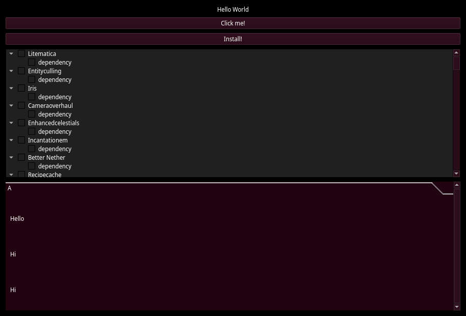

# Tristaller
Tristaller is a Minecraft mod manager for clients and servers running on Linux and Windows. The goal is to easily install modded profiles and keep these updated by simply dropping a "modpack_update.zip" on the portable executable.

What sets Tristaller apart from other projects is that no 3rd party game launchers are required. No installation into the system is required (only a single executable). Lastly the regular buildsystem for ImGui with Vulkan backend utilizes CMake, this has been stripped out and replaced by a good ol' Makefile.


# Overview
```
.
├── build
├── group_panel.cpp             -> To-be used as a UI element wrapper (credit: https://github.com/ocornut/imgui/issues/1496#issuecomment-655048353)
├── imgui.ini                   -> Stores UI layout
├── lib                         -> Submodules location
│   ├── glfw
│   └── imgui
├── Makefile
├── README.md
└── src
    ├── io.cpp
    ├── main.cpp                -> ImGui example as program entry
    └── tristaller.cpp          -> UI code
```

# Building from Source
---
Note: At the moment this project can only be built on Linux.
---
`$ git clone https://github.com/thomvhout/tristaller --recurse-submodules`   Clone the Tristaller repository.

Install the [Vulkan SDK](https://www.vulkan.org/tools#download-these-essential-development-tools).

Edit the Vulkan SDK path in the Makefile to your SDK install location.

`$ make` Build the project.

`$ ./build/tristaller` Run the executable.

# TODO
## Functionality
- [ ] Parse pack from path
- [ ] Create/install/remove pack
    - [ ] Parse `profiles.json`
## Build
- [ ] Makefile: Dynamic `VULKAN_SDK_PATH` in Windows
- [ ] Port Build for Windows: Potentially use `imgui/examples/example_glfw_opengl3/build_win32.bat`
## UI
- [X] Use ImGui `modals` as popup window for install process
## Misc
- [ ] Portability: Write used paths into executable itself
- [ ] Zip support: https://bitbucket.org/wbenny/ziplib/wiki/Home (built around streams)
- [ ] CLI support
- [ ] Implement path handling for each platform


This project started out in [QT](https://www.qt.io/) and Python. The choice to use ImGui was made because not all features included in QT are permitted to be used in an Open Source project. As a bonus Python is ditched for C++ and it is possible to write shaders for ImGui (e.g. for a cool moving background).
